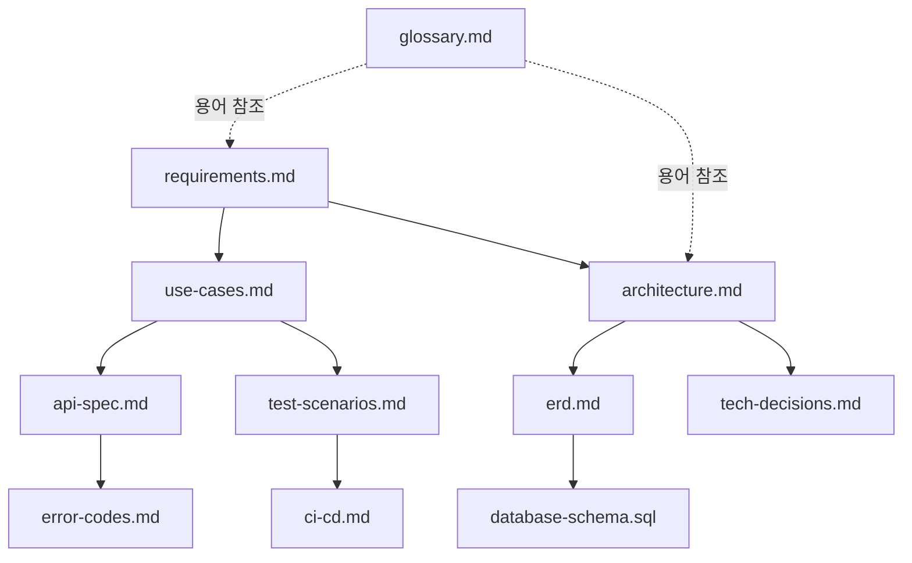

# 문서 인덱스

콘서트 티켓팅 backend starter-kit의 설계/구현 문서 모음이다. 아래 순서로 읽으면 요구사항 → 설계 → 구현 → 검증의 흐름을 따라갈 수 있다.

## 1. 요구사항 및 분석

| 문서 | 설명 |
|---|---|
| [requirements.md](./requirements.md) | 기능/비기능 요구사항, 이해관계자, 제약사항, 가정 |
| [use-cases.md](./use-cases.md) | 액터별 유즈케이스, 기본/대안/예외 흐름, 요구사항 추적 매트릭스 |
| [glossary.md](./glossary.md) | 도메인 용어집 |

## 2. 설계

| 문서 | 설명 |
|---|---|
| [architecture.md](./architecture.md) | 패키지 구조, 좌석 선점 동시성 제어(Redis 락 vs DB 락), 대기열 아키텍처, 요청 흐름 시퀀스 |
| [tech-decisions.md](./tech-decisions.md) | 기술 스택 선택 근거, 두 동시성 전략 비교표, 향후 검토 대상 |
| [erd.md](./erd.md) | Mermaid ERD, 테이블 관계 및 설계 노트 |
| [database-schema.sql](./database-schema.sql) | 참조용 DDL (MySQL) |

## 3. 인터페이스

| 문서 | 설명 |
|---|---|
| [api-spec.md](./api-spec.md) | 전체 REST API 엔드포인트, 요청/응답 예시 |
| [error-codes.md](./error-codes.md) | 에러 코드 체계 및 도메인별 코드 목록 |

## 4. 검증 및 자동화

| 문서 | 설명 |
|---|---|
| [test-scenarios.md](./test-scenarios.md) | 단위/통합/동시성 테스트 시나리오 (TestContainers 기반) |
| [ci-cd.md](./ci-cd.md) | CI 파이프라인 설명 (실제 정의: [`.github/workflows/ci.yml`](../.github/workflows/ci.yml)) |

## 5. 문서 간 관계도

## 6. 구현 현황

이 문서 세트는 구현 착수 전 확정된 설계 계약으로 시작했으며, 현재는 아래 항목까지 구현·테스트가 완료된 상태다.

- 엔티티/Repository (도메인 패키지별, [architecture.md](./architecture.md#2-패키지-구조-ddd-스타일-단일-gradle-모듈) 구조 기준)
- `SeatHoldStrategy` 두 구현체(Redis 분산락/DB 비관적 락) + `ReservationFacade` 오케스트레이션
- 대기열 Redis 연동(진입/상태조회/승급 스케줄러)
- Mock 결제 → 좌석 확정 → 티켓 발급, 콘서트 매진(SOLD_OUT) 자동 전환(FR-20)
- 예약 취소(UC-11), 본인 예약 목록 조회(UC-10), 선점 만료 스케줄러
- 예매 오픈 전/마감 후 구분(`BOOKING_NOT_OPEN`/`BOOKING_CLOSED`), 대기열 미진입/만료 구분(`QUEUE_REQUIRED`/`QUEUE_TOKEN_EXPIRED`)
- JWT 기반 인증/인가, 관리자 API(콘서트/좌석 등급/좌석 등록)
- `docker-compose.yml`(로컬 개발용 MySQL+Redis) + TestContainers(테스트용) 이원화
- SpringDoc OpenAPI 커스터마이징(`OpenApiConfig`) — 도메인별 태그, JWT Bearer 인증 지원. `./gradlew bootRun` 후 `http://localhost:8080/swagger-ui.html`에서 확인
- [test-scenarios.md](./test-scenarios.md) 시나리오 기준 JUnit5 테스트 작성 — 단위(Mockito)/통합(TestContainers)/동시성(ExecutorService) 3계층, `./gradlew clean test` 그린 상태 유지

**의도적으로 구현하지 않은 항목** (문서화는 하되 기능은 보류): 대기열 진입 API는 익명(비인증) 방식이라 동일 사용자의 중복 진입 방지(`QUEUE_ALREADY_ENTERED`)는 구현하지 않았다 — 구현하려면 이 API에 인증을 강제해야 하고 대기열 흐름 전체가 바뀌므로, 범위를 벗어난다고 판단해 문서에서도 제거했다 ([api-spec.md](./api-spec.md#3-대기열-queue) 참고).

향후 확장 포인트(요구사항 범위 밖으로 명시된 항목, [requirements.md](./requirements.md#12-범위) 참고): 실제 PG 연동, 환불 정책 상세화, 알림, 관리자 대시보드 UI, 다국어 지원.
