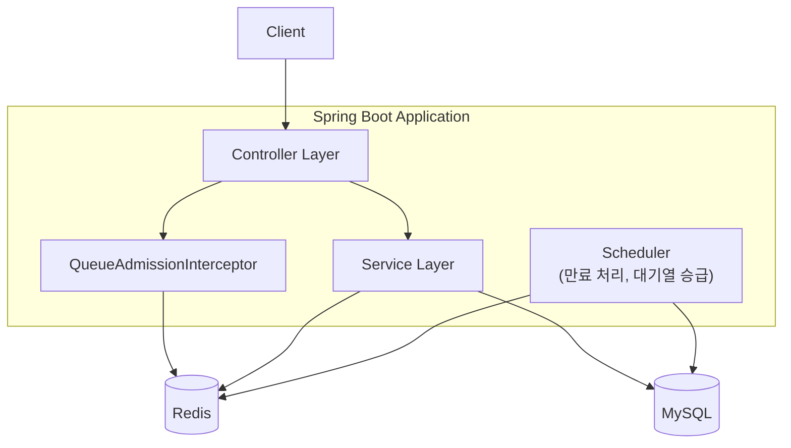
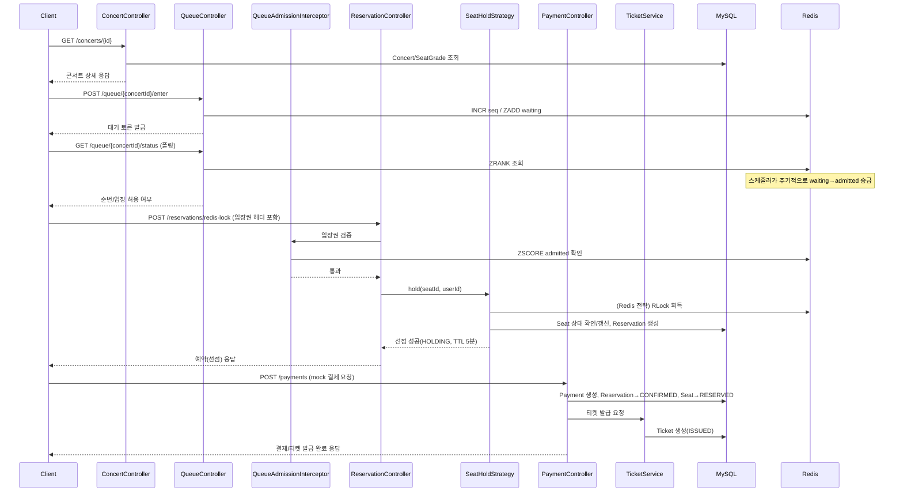

# 아키텍처 문서

> 관련 문서: [요구사항 명세서](./requirements.md) · [ERD](./erd.md) · [API 명세서](./api-spec.md) · [기술 선택 근거](./tech-decisions.md)

## 1. 시스템 개요

콘서트 티켓팅 backend starter-kit은 단일 Gradle 모듈, 도메인 기반 패키지 구조(DDD 스타일)로 구성된 Spring Boot 애플리케이션이다. 핵심 설계 목표는 **오픈런 트래픽 대응(대기열)**과 **좌석 동시 선점 정합성(락 전략 비교)** 두 가지를 학습 가능한 형태로 제공하는 것이다.



## 2. 패키지 구조 (DDD 스타일, 단일 Gradle 모듈)

```
src/main/java/starters/springboot/claude/starterkit/
├── StarterkitApplication.java
│
├── common/                          # 횡단 관심사
│   ├── config/     (SecurityConfig, WebConfig, RedissonConfig, OpenApiConfig, JpaAuditingConfig, SchedulingConfig)
│   ├── exception/  (GlobalExceptionHandler, ErrorCode, BusinessException)
│   ├── response/   (ApiResponse)
│   └── lock/       (LockStrategyType — REDIS / PESSIMISTIC 식별자)
│
├── user/            (controller / service / repository / domain / dto)
├── concert/         (Concert, SeatGrade, Seat 및 조회 API)
├── queue/
│   ├── controller/  (QueueController)
│   ├── service/     (QueueTokenService)
│   ├── infra/       (RedisWaitingQueueRepository — Sorted Set 조작 캡슐화)
│   ├── interceptor/ (QueueAdmissionInterceptor)
│   └── dto/
├── reservation/
│   ├── controller/  (ReservationController)
│   ├── service/
│   │   ├── ReservationFacade.java               # 오케스트레이션(선점→예약 생성)
│   │   ├── SeatHoldStrategy.java                 # 전략 인터페이스
│   │   ├── RedisLockSeatHoldStrategy.java        # Redisson 구현체
│   │   ├── PessimisticLockSeatHoldStrategy.java  # JPA @Lock 구현체
│   │   ├── ReservationQueryService.java          # 본인 예약 목록 조회(UC-10)
│   │   └── ReservationCancelService.java         # 예약 취소(UC-11)
│   ├── repository/, domain/, scheduler/(ReservationExpirationScheduler), dto/
├── payment/         (PaymentService, MockPgClient)
└── ticket/          (TicketService)
```

**설계 근거**
- 도메인 패키지 하위에 `controller/service/repository/domain/dto`를 두는 "도메인 우선" 구조를 채택했다. 계층 우선(최상위에 `controller/`, `service/`)으로 두면 도메인이 커질수록 특정 기능 관련 코드를 한 곳에서 찾기 어려워진다.
- `queue`를 `reservation`의 하위가 아닌 독립 도메인으로 분리한 이유는, 대기열이 "예약"의 부속 기능이 아니라 **트래픽 제어**라는 독립된 관심사이기 때문이다. `infra/`로 Redis 접근 로직을 캡슐화해 서비스 계층이 Redis API를 직접 다루지 않게 한다.
- 락 전략 구현체(`RedisLockSeatHoldStrategy`, `PessimisticLockSeatHoldStrategy`)를 `common`이 아닌 `reservation/service`에 둔 이유는, 범용 유틸리티가 아니라 HOLD TTL·상태 전이 규칙과 강하게 결합된 **도메인 로직**이기 때문이다.

## 3. 좌석 선점 동시성 제어 — 두 전략 비교 설계

### 3.1 왜 두 가지 전략을 나란히 제공하는가

이 starter-kit의 목적은 "실서비스에서 어느 하나를 선택하는 것"이 아니라 **두 방식을 나란히 놓고 트레이드오프를 비교 학습**하는 것이다. Strategy 패턴으로 인터페이스(`SeatHoldStrategy`)를 공유하되, 같은 URL에 쿼리 파라미터로 분기하지 않고 **별도 엔드포인트**로 노출한다.

```java
public interface SeatHoldStrategy {
    SeatHoldResult hold(Long seatId, Long userId, Long reservationId);
}
```

| 엔드포인트 | 전략 구현체 |
|---|---|
| `POST /api/v1/reservations/redis-lock` | `RedisLockSeatHoldStrategy` |
| `POST /api/v1/reservations/pessimistic-lock` | `PessimisticLockSeatHoldStrategy` |

별도 엔드포인트로 분리하면 (1) Swagger UI에 각각 트레이드오프를 문서화하기 쉽고, (2) k6/JMeter 부하테스트 스크립트를 엔드포인트 단위로 나눠 성능을 직접 비교 측정할 수 있다. `ReservationFacade`는 두 구현체를 동일한 인터페이스로 호출하므로 오케스트레이션 로직 중복은 없다.

### 3.2 ① Redis 분산락 (`RedisLockSeatHoldStrategy`)

- **Redisson** 사용 — `RLock` (build.gradle에 `org.redisson:redisson-spring-boot-starter` 추가 필요, 근거는 [tech-decisions.md](./tech-decisions.md) 참고)
- 락 키: `lock:seat:{seatId}`
- 흐름: `tryLock(waitTime=3s, leaseTime=5s)` → 락 획득 성공 시 DB에서 `Seat` 조회(일반 조회) → 상태가 `AVAILABLE`인지 확인 후 `HELD`로 업데이트 + `Reservation`/`ReservationSeat` 생성 → `finally`에서 `unlock()`
- watchdog(leaseTime 자동 연장)은 기본 끔 — 락이 예상보다 오래 유지되는 디버깅 난이도를 낮추기 위해 leaseTime 고정을 추천
- 락은 짧게(leaseTime 3~5초), DB 트랜잭션도 락 내부에서 최소화 → 커넥션 점유 최소화가 핵심 목적

### 3.3 ② DB 비관적 락 (`PessimisticLockSeatHoldStrategy`)

```java
@Lock(LockModeType.PESSIMISTIC_WRITE)
@Query("select s from Seat s where s.id = :id")
Optional<Seat> findByIdForUpdate(@Param("id") Long id);
```

- `@Transactional` 메서드 내에서 `SELECT ... FOR UPDATE`로 해당 좌석 row에 배타락 → 상태 확인 → `HELD` 갱신 → 예약 저장까지 한 트랜잭션, 커밋 시점에 락 해제
- 여러 좌석을 한 번에 선점할 때는 데드락 방지를 위해 반드시 `seatId` 오름차순으로 순차 락 획득

정량적 트레이드오프 비교표는 [tech-decisions.md](./tech-decisions.md#redis-분산락redisson-vs-db-비관적-락-비교) 참고.

## 4. 대기열 시스템 아키텍처

### 4.1 Redis 자료구조

| Key | 자료구조 | 용도 |
|---|---|---|
| `queue:{concertId}:seq` | String (INCR) | 동시 요청의 순서 보장 tie-breaker |
| `queue:{concertId}:waiting` | **Sorted Set** | member=token, score=seq. 대기 순번 관리 |
| `queue:{concertId}:admitted` | **Sorted Set** | member=token, score=입장 만료시각(epoch millis). 입장권 검증/정리 |

### 4.2 흐름

1. `POST /queue/{concertId}/enter` → `INCR seq` → `ZADD waiting {seq} {token}` → 토큰 발급
2. `GET /queue/{concertId}/status?token=...` → `ZRANK`로 순번 조회, 예상 대기시간 계산
3. 입장 승급 스케줄러(`@Scheduled(fixedDelay=2000)`)가 Lua 스크립트로 원자적으로 `ZPOPMIN`(상위 K명, K=`app.queue.admission-rate`) → `admitted`에 `score=now+TTL(10분)`로 `ZADD`
4. 좌석 선점 API(`POST /reservations/redis-lock`, `POST /reservations/pessimistic-lock`)만 `QueueAdmissionInterceptor`의 검증 대상이다(`WebConfig`에서 경로를 이 두 엔드포인트로 한정 — 목록 조회/취소는 이미 선점을 마친 사용자의 후속 조치이므로 대상 아님). 인터셉터는 토큰이 `admitted`에 존재하고 `score > now`인지 확인하며, 두 경우를 구분해 응답한다: 아예 없으면(미진입/미승급) `403 QUEUE_REQUIRED`, 존재하지만 `score <= now`(만료)면 `403 QUEUE_TOKEN_EXPIRED`
5. 스케줄러가 주기적으로 `ZREMRANGEBYSCORE(-inf, now)`로 만료 토큰을 정리한다 — 정리된 이후에는 4번의 "만료" 판별이 "미진입"과 구분되지 않게 되어 `QUEUE_TOKEN_EXPIRED`가 아닌 `QUEUE_REQUIRED`로 응답한다(허용 가능한 트레이드오프로 판단)
6. 대기열 진입(`POST /queue/{concertId}/enter`)은 인증을 요구하지 않는 익명 API다. 토큰이 사용자 신원과 연결되지 않으므로(요청마다 새 UUID 발급) 동일 사용자의 중복 진입을 막는 검증은 없다 — 구현하려면 이 API에 인증을 강제해야 하고 대기열 흐름 전체가 바뀌므로 이 starter-kit 범위에서는 의도적으로 생략했다

**왜 List가 아닌 Sorted Set인가**: 대기열은 FIFO뿐 아니라 "내 순번이 몇 번째인지" 실시간 조회(`ZRANK`, O(log N))가 필수다. Redis List는 이 기능이 없다. `ZPOPMIN`/`ZREMRANGEBYSCORE`로 승급·만료 처리도 원자적으로 수행 가능하다.

## 5. 요청 흐름 시퀀스 (콘서트 조회 → 티켓 발급)



## 6. 정합성 원칙

- **`seats.status` = 단일 진실 소스(Single Source of Truth)**: Redis 락 전략이든 DB 비관적 락 전략이든, 최종적으로 "이 좌석이 선점/예약되었는가"의 판단 기준은 항상 `seats.status`다. Redis는 락(뮤텍스) 또는 캐시일 뿐 정합성의 최종 근거가 아니다.
- **락 leaseTime과 HOLD TTL의 분리**: 락 leaseTime(3~5초)은 "요청 처리 중 잠깐의 배타성"만 보장하면 되고, 실제 5분짜리 HOLD 상태 유지는 DB(`seats.status`+`hold_expires_at`)가 책임진다. 락을 5분 동안 붙잡으면 동시 처리량이 급락하므로 반드시 분리한다.

## 7. 환경 구성 (로컬/테스트)

- **로컬 개발**: [`docker-compose.yml`](../docker-compose.yml)이 MySQL 8(+ 볼륨으로 데이터 영속화, `docs/database-schema.sql`을 초기화 스크립트로 자동 적용)과 Redis 7을 기동한다. 호스트에 이미 로컬 MySQL(3306)이 떠 있을 수 있어 컴포즈 쪽은 `3307:3306`으로 매핑했다. `application.yaml`은 이 컴포즈 스택을 가리키는 값을 기본값으로 갖고 있어 `docker compose up -d && ./gradlew bootRun`만으로 바로 동작한다.
- **`spring.jpa.hibernate.ddl-auto=validate`(로컬)**: 스키마는 `docs/database-schema.sql`이 단일 진실 소스이므로 Hibernate가 스키마를 만들거나 고치지 않고, 엔티티 매핑이 그 스키마와 일치하는지만 검증한다. 이 덕분에 엔티티와 DDL 문서가 어긋나면 `bootRun` 시점에 바로 드러난다 (실제로 `Concert.description`을 `@Lob`(LONGTEXT)으로 매핑했다가 DDL의 `TEXT`와 불일치해 검증 실패했던 사례가 있었다 → `@Column(columnDefinition = "TEXT")`로 수정).
- **테스트**: `ContainerTestSupport`는 TestContainers로 별도의 MySQL/Redis를 띄우고 `ddl-auto=update`를 쓴다(로컬의 `validate`와 다름). 이유: 이 컨테이너는 테스트 프로세스 전체에서 하나만 공유되는데, `@TestPropertySource`가 다른 테스트 클래스마다 별도의 스프링 컨텍스트가 뜨면서 각자 `create-drop`을 쓰면 한 컨텍스트가 종료되며 테이블을 지울 때 같은 컨테이너를 쓰는 다른(아직 살아있는) 컨텍스트의 `@Scheduled` 빈이 그 테이블을 조회하다 오류를 내는 경합이 있었다.
- `RedissonConfig`의 host/port도 `spring.data.redis.host/port`를 참조하도록 하여 설정 이중 관리로 인한 누락 방지
- `SeatHoldStrategy` 인터페이스 덕분에, 동일한 동시성 테스트 코드를 두 구현체 각각에 적용 가능 (`@SpringBootTest` + TestContainers, 자세한 시나리오는 [test-scenarios.md](./test-scenarios.md) 참고)
