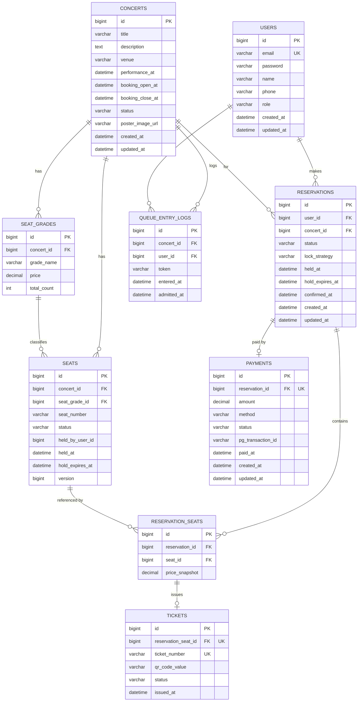

# ERD (Entity Relationship Diagram)

> 관련 문서: [데이터베이스 스키마 DDL](./database-schema.sql) · [아키텍처 문서](./architecture.md)
> 참고: `WaitingQueueToken`은 RDB 엔티티가 아닌 Redis 자료구조로 관리되므로 이 ERD에는 포함하지 않는다 (근거는 [아키텍처 문서](./architecture.md#대기열-시스템) 참고).

## 1. 전체 ERD

## 2. 관계 설명

| 관계 | 카디널리티 | 설명 |
|---|---|---|
| USERS → RESERVATIONS | 1:N | 한 사용자는 여러 예약을 만들 수 있으나, [비즈니스 규칙](./requirements.md) FR 상 콘서트당 활성(HOLDING/PENDING_PAYMENT) 예약은 1건으로 애플리케이션 레벨에서 제한 |
| CONCERTS → SEAT_GRADES | 1:N | 콘서트당 여러 좌석 등급(VIP/R/S/A 등) |
| CONCERTS → SEATS | 1:N | 콘서트당 다수 좌석 |
| SEAT_GRADES → SEATS | 1:N | 좌석은 하나의 등급에 속함 |
| RESERVATIONS → RESERVATION_SEATS | 1:N | 예약 1건에 최대 4석(정책상 제한)까지 라인아이템으로 연결 |
| SEATS → RESERVATION_SEATS | 1:N (준-1:1) | 좌석은 여러 `ReservationSeat` 이력(취소분 포함)을 가질 수 있으나, 유효(HELD/RESERVED) 상태에서는 최대 1건만 유효 — DB 유니크 제약이 아닌 `seats.status` 상태 머신으로 강제 |
| RESERVATIONS → PAYMENTS | 1:1 | 예약 1건당 결제 1건 (`uk_payments_reservation`) |
| RESERVATION_SEATS → TICKETS | 1:1 | 좌석 라인아이템마다 별도 QR 티켓 발급 (`uk_tickets_reservation_seat`) |

## 3. 설계 노트

- **`reservation_seats.seat_id`에 유니크 제약을 걸지 않은 이유**: 취소/만료된 예약 이력도 유지해야 하므로, 단순 유니크 제약은 재예약을 막아버린다. 좌석당 유효 예약 1건 규칙은 `seats.status`로 강제한다. ([database-schema.sql](./database-schema.sql) C-2 참고)
- **`seats.version`**: 낙관적 락 확장 및 Redis 락 경로의 CAS 안전망 용도로 사전에 마련해둔 컬럼
- **`payments`, `tickets`의 UNIQUE FK**: 1:1 관계를 DB 레벨에서 강제하기 위해 FK 컬럼에 유니크 제약을 부여
