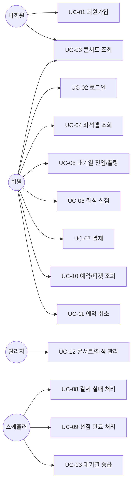

# 유즈케이스 명세서

> 관련 문서: [요구사항 명세서](./requirements.md) · [API 명세서](./api-spec.md) · [테스트 시나리오](./test-scenarios.md)

## 1. 액터 (Actor)

| 액터 | 설명 |
|---|---|
| 비회원 (Guest) | 로그인하지 않은 사용자. 조회만 가능 |
| 회원 (User) | 로그인한 일반 사용자. 예매 전체 플로우 수행 가능 |
| 관리자 (Admin) | 콘서트/좌석 데이터를 관리 |
| 스케줄러 (System) | 예약 만료 처리, 대기열 승급 처리를 수행하는 시스템 내부 행위자 |

## 2. 유즈케이스 다이어그램 (개요)

## 3. 유즈케이스 상세

### UC-01. 회원가입
- **액터**: 비회원
- **목적**: 예매 서비스 이용을 위한 계정 생성
- **사전조건**: 없음
- **기본 흐름**:
  1. 사용자가 이메일, 비밀번호, 이름을 입력해 가입을 요청한다
  2. 시스템은 이메일 중복 여부를 확인한다
  3. 시스템은 비밀번호를 암호화하여 저장하고 계정을 생성한다
- **대안 흐름**: 이메일이 이미 존재하면 `409 EMAIL_ALREADY_EXISTS` 반환
- **사후조건**: `users` 테이블에 신규 레코드 생성

### UC-02. 로그인
- **액터**: 회원
- **기본 흐름**:
  1. 이메일/비밀번호로 로그인 요청
  2. 시스템이 인증 후 세션/토큰 발급
- **예외 흐름**: 인증 실패 시 `401 INVALID_CREDENTIALS`

### UC-03. 콘서트 조회
- **액터**: 비회원, 회원
- **기본 흐름**:
  1. 콘서트 목록을 상태(UPCOMING/ON_SALE/SOLD_OUT/CLOSED)별로 조회
  2. 특정 콘서트 상세(제목, 공연장, 일시, 좌석 등급별 가격) 조회
- **사후조건**: 없음 (조회 전용)

### UC-04. 좌석맵 조회
- **액터**: 회원
- **사전조건**: 콘서트가 존재해야 함
- **기본 흐름**:
  1. 사용자가 콘서트의 전체 좌석 배치와 상태(AVAILABLE/HELD/RESERVED)를 조회
- **비즈니스 규칙**: 예매 오픈 시각 이전에도 조회는 가능하나, 선점 API는 [UC-06](#uc-06-좌석-선점)에서 거부됨 (FR-06)

### UC-05. 대기열 진입 및 순번 확인
- **액터**: 회원
- **사전조건**: 해당 콘서트가 대기열 활성화 상태(`app.queue.enabled`)
- **기본 흐름**:
  1. 사용자가 대기열 진입 요청 → 대기 토큰 발급
  2. 사용자가 주기적으로 상태를 폴링하여 현재 순번 확인
  3. 순번이 도달하면([UC-13](#uc-13-대기열-승급-시스템) 스케줄러에 의해) 입장 허용 상태로 전환, TTL이 있는 입장권 획득
- **대안 흐름**: 입장권 TTL 만료 시 재진입 필요 (2단계로 복귀)
- **사후조건**: `admitted` Sorted Set에 사용자 토큰 등록

### UC-06. 좌석 선점 (핵심 유즈케이스)
- **액터**: 회원
- **사전조건**:
  - 예매 오픈 시각 도달 (FR-06)
  - 대기열 활성화 콘서트의 경우, 유효한 입장권 보유 (FR-09)
- **기본 흐름**:
  1. 사용자가 좌석(1~4석)을 선택하고 선점 요청 (Redis 락 방식 또는 DB 비관적 락 방식 중 선택)
  2. 시스템은 선택한 동시성 전략으로 좌석 상태를 `AVAILABLE → HELD`로 원자적으로 전환
  3. `Reservation`(status=HOLDING), `ReservationSeat` 생성, `hold_expires_at` 설정(기본 5분)
  4. 콘서트 전 좌석이 `RESERVED`가 되면 `Concert.status → SOLD_OUT` (FR-20, 비동기 처리 가능)
- **예외 흐름**:
  - 이미 `HELD`/`RESERVED`인 좌석 요청 시 `409 SEAT_ALREADY_HELD`
  - 대기열 미통과 시 `403 QUEUE_REQUIRED`
  - 예매 미오픈 시 `403 BOOKING_NOT_OPEN`
- **비즈니스 규칙**: 동일 좌석 동시 요청 중 정확히 1건만 성공해야 함 (FR-11, NFR-01) — starter-kit의 핵심 검증 대상
- **사후조건**: 좌석 상태 `HELD`, 예약 `HOLDING` 상태 생성

### UC-07. 결제
- **액터**: 회원
- **사전조건**: `HOLDING` 상태의 예약 보유, `hold_expires_at` 이전
- **기본 흐름**:
  1. 사용자가 결제 요청 (Mock PG 호출)
  2. Mock PG가 성공 응답
  3. 시스템이 하나의 트랜잭션(또는 보상 트랜잭션)으로: `Payment` 생성(PAID), `Seat.status → RESERVED`, `Reservation.status → CONFIRMED`, `Ticket` 발급(ISSUED)
- **사후조건**: 사용자는 발급된 티켓을 [UC-10](#uc-10-예약티켓-조회)에서 조회 가능

### UC-08. 결제 실패 처리
- **액터**: 시스템 (Mock PG 실패 응답에 의해 트리거)
- **기본 흐름**:
  1. Mock 결제가 실패 응답을 반환
  2. 시스템은 `Payment.status → FAILED`, 좌석을 즉시 `AVAILABLE`로 반환, `Reservation.status → CANCELLED`
- **사후조건**: 다른 사용자가 즉시 해당 좌석 재선점 가능 (FR-16)

### UC-09. 좌석 선점 만료 처리 (배치)
- **액터**: 스케줄러(System)
- **트리거**: 주기적 스케줄(`ReservationExpirationScheduler`)
- **기본 흐름**:
  1. `status='HOLDING' AND hold_expires_at < NOW()`인 예약을 조회
  2. 해당 예약을 `EXPIRED`로 전환, 연결된 좌석을 `AVAILABLE`로 반환
- **비즈니스 규칙**: FR-13 (기본 5분 HOLD 타임아웃)

### UC-10. 예약/티켓 조회
- **액터**: 회원
- **기본 흐름**: 본인 예약 내역 목록 조회, 예약별 발급 티켓(QR 포함) 조회
- **비즈니스 규칙**: 본인 소유 예약만 조회 가능 (Spring Security 인가)

### UC-11. 예약 취소
- **액터**: 회원
- **사전조건**: 예약 상태가 `CONFIRMED`, 공연 D-1 이전
- **기본 흐름**: 취소 요청 → `Reservation.status → CANCELLED`, `Ticket.status → CANCELLED`
- **예외 흐름**: D-1 이내 취소 시도 시 `422 CANCELLATION_DEADLINE_PASSED` (FR-18)

### UC-12. 콘서트/좌석 관리
- **액터**: 관리자
- **기본 흐름**: 콘서트 등록/수정, 좌석 등급 등록, 좌석 일괄 생성
- **비즈니스 규칙**: Spring Security `ROLE_ADMIN` 권한 필요

### UC-13. 대기열 승급 시스템 (배치)
- **액터**: 스케줄러(System)
- **트리거**: 주기적 스케줄 (`fixedDelay=2000ms`)
- **기본 흐름**:
  1. `waiting` Sorted Set에서 상위 K명(`app.queue.admission-rate`)을 `ZPOPMIN`
  2. `admitted` Sorted Set에 `score=now+TTL`로 등록
  3. 만료된 `admitted` 항목을 `ZREMRANGEBYSCORE`로 정리
- **사후조건**: 승급된 사용자가 [UC-06](#uc-06-좌석-선점) 진입 가능

## 4. 요구사항 추적 매트릭스

| UC | 관련 FR | 관련 API | 관련 테스트 시나리오 |
|---|---|---|---|
| UC-01 | FR-01 | `POST /api/v1/users/signup` | [test-scenarios.md](./test-scenarios.md) TS-AUTH-01 |
| UC-02 | FR-02 | `POST /api/v1/auth/login` | TS-AUTH-02 |
| UC-03 | FR-03, FR-04 | `GET /api/v1/concerts`, `GET /api/v1/concerts/{id}` | TS-CONCERT-01 |
| UC-04 | FR-05, FR-06 | `GET /api/v1/concerts/{id}/seats` | TS-CONCERT-02 |
| UC-05 | FR-07, FR-08, FR-09 | `POST /api/v1/queue/{concertId}/enter`, `GET /api/v1/queue/{concertId}/status` | TS-QUEUE-01~03 |
| UC-06 | FR-10~FR-12, FR-20 | `POST /api/v1/reservations/redis-lock`, `POST /api/v1/reservations/pessimistic-lock` | TS-RESV-01~05 (동시성 핵심) |
| UC-07 | FR-14, FR-15 | `POST /api/v1/payments` | TS-PAY-01 |
| UC-08 | FR-16 | (내부 로직) | TS-PAY-02 |
| UC-09 | FR-13 | (스케줄러) | TS-RESV-06 |
| UC-10 | FR-17 | `GET /api/v1/reservations`, `GET /api/v1/tickets` | TS-RESV-07 |
| UC-11 | FR-18 | `DELETE /api/v1/reservations/{id}` | TS-RESV-08 |
| UC-12 | FR-19 | `POST /api/v1/admin/concerts` 등 | TS-ADMIN-01 |
| UC-13 | FR-08 | (스케줄러) | TS-QUEUE-04 |
